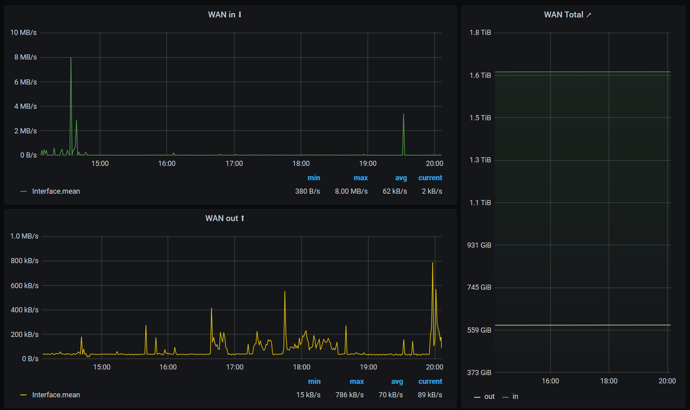

# Windows Batch: fbox_get-bytes-to-telegraf.cmd
Ich wollte den Traffic meiner Fritz!Box gerne in Grafana anzeigen. Da die Boxen leider freiwillig kein SNMP sprechen, muss man die Daten manuell via UPNP abholen, das XML der Ausgabe parsen und die Werte dann (in meinem Fall nach Telegraf) schreiben. Im Moment ist das noch ein (ser einfaches) Batch Script, aber mein nächstes Projekt wird (ganz bestimmt!!11) die Übersetzung nach PowerShell 😂

Damit ich nicht jedesmal wenn ich das neu baue wieder am Syntax herumprobieren muss, hier das vollständige Setup.

## Prerequisites
* Windows 10 / Server 2016
* curl https://github.com/curl/curl-for-win (oder aus Chocolatey)

## Danke
* XMLStarlet Toolkit http://xmlstar.sourceforge.net/

## Wie
Das Script holt auch nicht alles ab, sondern nur was ich für meine schicken Traffic-Stats brauche:
* NewByteSendRate
* NewByteReceiveRate
* NewTotalBytesSent
* NewTotalBytesReceived
* NewX_AVM_DE_TotalBytesSent64
* NewX_AVM_DE_TotalBytesReceived64

Die `*64` Werte sind die neuen 64bit OiDs, denn 32bit reichen bei aktuellen Bandbreiten nicht mehr aus.

## Verwendung
1. `git clone https://github.com/weed-/fbox_get-bytes-to-telegraf`
2. Anpassen der beiden "CONFIG" Zeilen:
```
REM --- CONFIG: Die Fritz!Box
set fboxlanv4=<DEINE FRITZBOX>
    
REM --- CONFIG: Telegraf Ziel
set telegrafurl=<DEINE TELEGRAF WRITE URL>
```

Wenn das klappt, das Script einfach regelmäßig aufrufen und ein schickes Grafana Dashbaord dazu klicken.

Viel Spaß 🙂